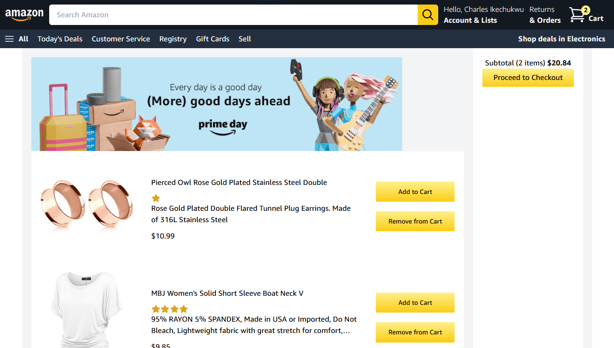
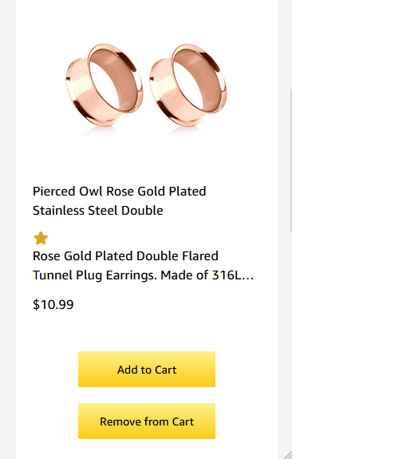
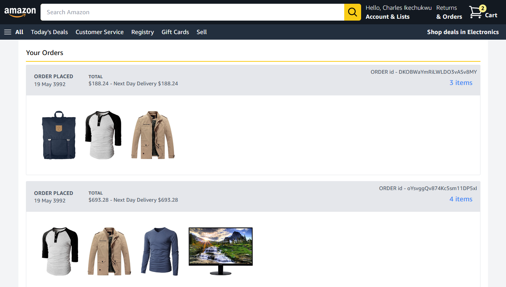
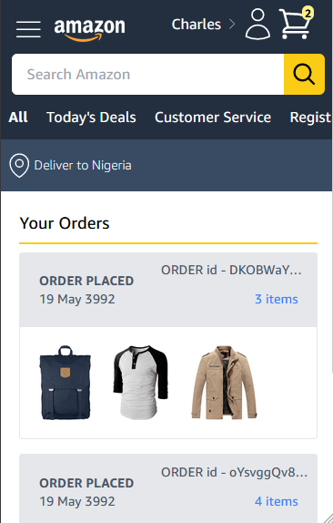
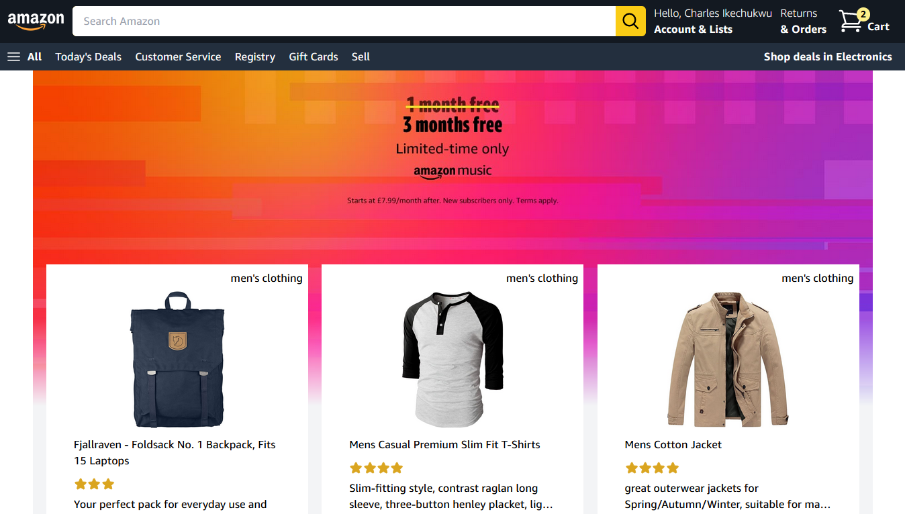
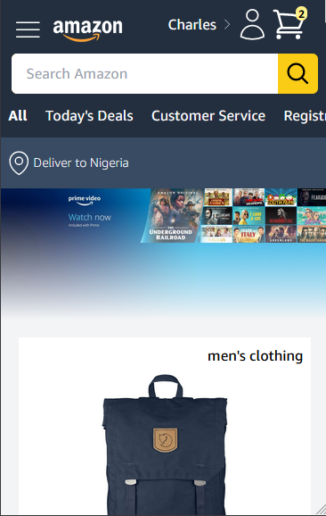
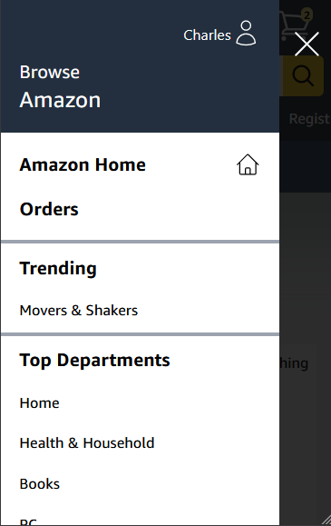

# MichtheBrand - Amazon Clone Web app built with Nixix, TailwindCSS, Firebase and Flutterwave

This is a e-commerce web app where users can buy products - just a demo.

## Table of contents

- [Overview](#overview)
  - [Disclaimer](#disclaimer)
  - [The challenge](#the-challenge)
  - [Screenshot](#screenshot)
  - [Links](#links)
- [My process](#my-process)
  - [Built with](#built-with)
  - [What I learned](#what-i-learned)
  - [Useful resources](#useful-resources)
- [Author](#author)
- [Acknowledgments](#acknowledgments)

## Overview 

### Disclaimer 

Please do not add your card details when testing this app - contact me for the card details. 👍

### The challenge

Users should be able to: 

- View the optimal layout for the interface depending on their device's screen size 
- Sign in and sign out using their Google accounts
- Add and remove products to and from their cart
- Make payments with their card - Please contact me for the card details you should put in for the payment
- View their previous checkouts and orders when they sign in

### Screenshot

### Links 

- Source code URL: [Git repository for the project](https://github.com/michTheBrandofficial/Amazon-clone.git)
- Live Site URL: [Amazon Clone](https://ecommerce-clone-7f081.web.app)

## My process 

### Built with 

- 🚀 NixixJS (signals, stores, effects - Blazingly fast)
- 💻 VS Code
- ❤️ Love for frontend development
- 💽 Firebase
- 💳 Flutterwave
- 💈 TailwindCSS
- 📲 Mobile first workflow(Thanks to TailwindCSS)
- Responsive CSS 
- 🥽 Observer pattern in JavaScript
- 🕐 Moment.js

### What I learned

- I learnt how to create, add, update and query my Firebase Firestore database.
- I improved my problem solving skills and how to architect web apps.
- I learnt more about NixixJS signals and how they make DOM updates very fast.

### Useful resources 

- Firebase - [Firebase Docs](https://firebase.google.com/docs) will guide you on how to use their services
- NixixJS - [NixixJS](https://github.com/michTheBrandofficial/NixixJS#readme) will guide you on how to use NixixJS(Blazingly fast framework)
- TailwindCSS - [TailwindCSS](https://v2.tailwindcss.com/docs) will guide you on how to use their css classes

### Author

- LinkedIn - [michTheBrandofficial](https://www.linkedin.com/in/charles-ikechukwu-719b4824a)
- DEV.to - [michthebrandofficial](https://dev.to/michthebrandofficial)
- Github - [michTheBrandofficial](https://github.com/michTheBrandofficial)
- Frontend Mentor - [michTheBrandofficial](https://frontendmentor.io/profile/michTheBrandofficial)

### Acknowledgments 

I want to say a big thank you to [Sonny Sangha](http://www.youtube.com/@SonnySangha) for providing this challenge.
It really helped me build relevant skills and I also learnt a little about databases and Full Stack development.

I want to thank [Sagar Developer](http://www.youtube.com/@SagarDevloper) for his youtube video which taught me how to make a Skeleton loading effect with HTML and CSS.

I want to thank my siblings and friends for helping me to test the app. 